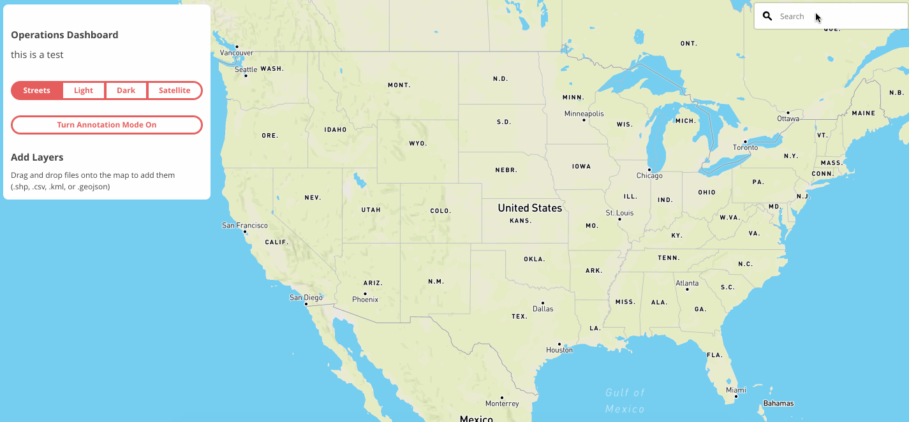
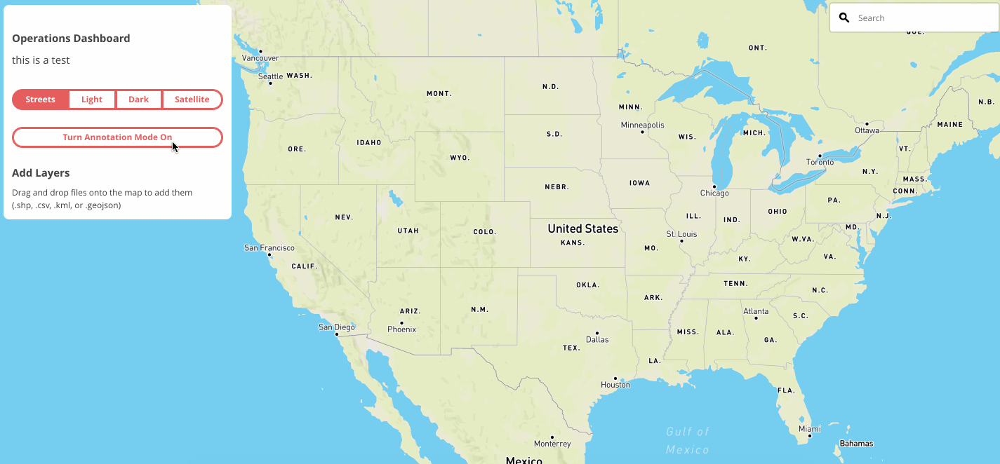
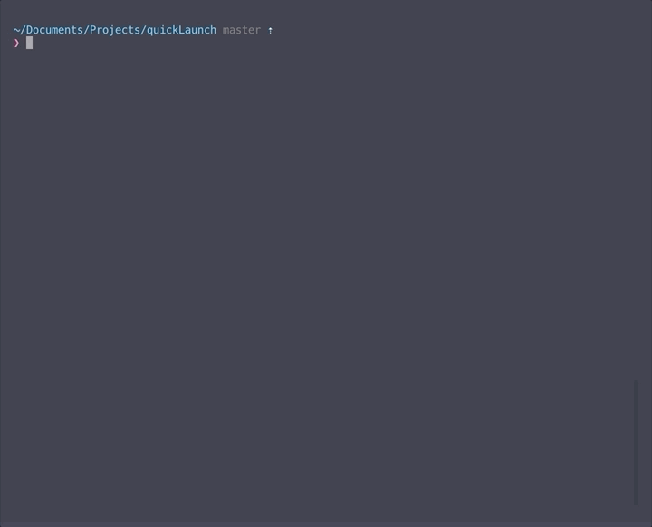
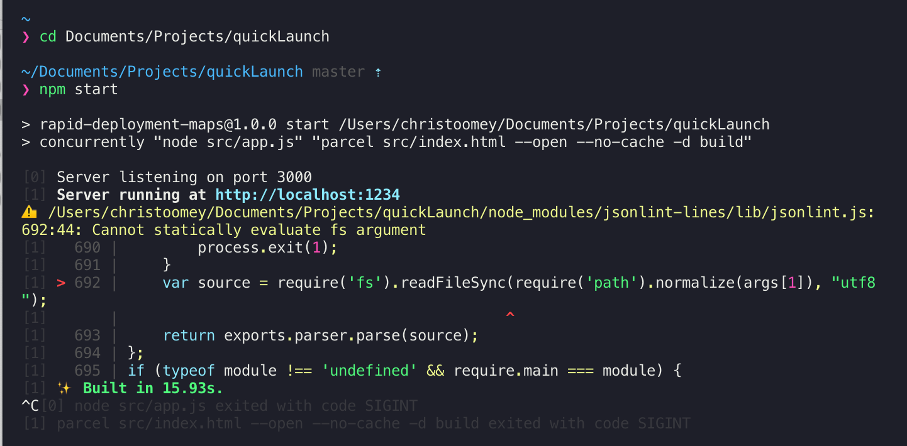

# Mapbox Rapid Deploy

Mapbox Rapid Deploy is a workflow that creates a situational awareness dashboard. It enables users to connect to their internal data sources, collaboratively annotate the map, and share knowledge with their stakeholders. Rapid Deploy works out of the box in both online and offline environments and can be customized to fit any use case.
- [Mapbox Rapid Deploy](#mapbox-rapid-deploy)
  - [Getting Started](#getting-started)
    - [Requirements](#requirements)
      - [Mapbox account](#mapbox-account)
      - [Data](#data)
      - [Node](#node)
      - [Docker](#docker)
      - [MongoDB](#mongodb)
  - [Development](#development)
    - [Installation](#installation)
    - [Custom Styles](#custom-styles)
    - [Search](#search)
    - [Errors](#errors)
  - [Deployment](#deployment)
    - [Environment Considerations](#environment-considerations)
      - [From BUILD Directory](#from-build-directory)
      - [Separate Infrastructure](#separate-infrastructure)
  - [Built With](#built-with)
  - [Authors](#authors)
  - [License](#license)

## Getting Started

These instructions will create a development version of the dashboard and set up a live-reloading local environment. To deploy into production, see [Deployment](#deployment). If you need a fully offline development environment, you can [download a ZIP](https://github.com/mapbox/rapidDeploy/releases/download/v1.0/RapidDeployOffline.zip) file from `Releases` that includes all development dependencies.

Rapid Deploy provides the following functionality:

1. Connection to Mapbox.com OR Mapbox Atlas
2. Search Bar

3. Swappable base styles (defaults below)
   - Mapbox Streets
   - Mapbox Light
   - Mapbox Dark
   - Mapbox Satellite

4. Drag-and-Drop data
   - Geojson
   - Shapefiles
   - CSV
   - KML

5. Annotations: Draw your own shapes and add metadata


### Requirements

To begin development, you will need the following:

#### Mapbox account

You will need a valid Mapbox token to make requests to Mapbox APIs with a public (`pk`) token scope. Sign up for Mapbox [here](https://mapbox.com/signup) and find your access token [here](https://account.mapbox.com/). If you are developing against Atlas, you will need the token provided from your Atlas dashboard. Atlas Search is required for offline geocoding to function.

#### Data

There is sample geojson data provided in the `data` folder. Rapid Deploy supports KML, CSV, geoJSON, or Shapefiles via drag-and-drop.

If you wish to use Mapbox or Atlas hosted tilesets - either add them to a style and [update the chosen style](https://github.com/mapbox/operationsDashboardBlueprint/blob/master/template/template.js#L285) or add the tilesets to the map [programatically](https://docs.mapbox.com/mapbox-gl-js/example/vector-source/).

```javascript
map.addLayer({
  "id":"layerid",
  "type":"layertype",
  "source":{
    type:'vector',
    url:'mapbox://tilesetid'
  },
  "source-layer":"source",
  [...]
})
```

#### Node

You must have Node v8.15+ installed.

#### Docker

For development purposes only, you will need to have [Docker installed](https://docs.docker.com/install/). Docker is used to start a local MongoDB instance. This instance **WILL NOT** preserve data if you choose to shut it down.

For more persistent storage, you may choose to install [Mongo directly](#mongodb).

#### MongoDB

For production use, or if you do not wish to use Docker, you must install MongoDB v4.0.3+. For instructions on installing Mongo in your environment, consult the [MongoDB documentation](https://docs.mongodb.com/manual/installation/#supported-platforms).

For development, this dashboard will run a Dockerized version of Mongo. You can use this in the production version of your application, but we recommend you deploy an independent version to avoid data loss.

The version of MongoDB used in the Docker container is MongoDB Community edition. This is free-to-use and features are documented on the [MongoDB website](https://docs.mongodb.com/manual/).

To use enterprise features, you must procure your own MongoDB Enterprise license and update the Rapid Deploy accordingly. Mapbox will not provide MongoDB support.

---

## Development

- `src`
  - `config.js`: Initial configuration script to build your custom dashboard.
  - `app.js`: Server script to communictate with MongoDb.
  - template: folder that contains templated HTML and Javascript files for dashboard.
  - vendor: folder that contains static JS and CSS files for offline dashboard functionality.
- `data`
  - Contains sample `data.geojson` for testing drag-and-drop functionality.

### Installation

> *If you wish to develop in a fully offline environment, please download RapidDeployOffline.zip from Releases. Then skip to Step 3.*

1. Clone this repository

```bash
git clone git@github.com:mapbox/rapidDeploy.git
cd rapidDeploy
```

2. Install Dependencies

```bash
npm ci
```

3. Run the initial config

```bash
npm run config
```



> The Favicon and Logo are optional and do not affect the functionality of Rapid Deploy.

This will update the template code and produce a development-ready version of the dashboard, as well as start the Dockerized MongoDB. If you would like to verify that MongoDB is running, run `curl localhost:27017` and you should see the following:


4. Start the website server and application server

```bash
npm start
```

Your application will auto-compile and a browser window will open at `http://localhost:1234`

### Custom Styles

If you are using Mapbox.com as your endpoint, the layer toggle will work as shown [below](#functionality). If you are using Atlas, you will need to swap the layers and IDs to styles hosted in Atlas.

IDs and labels are found in `index.html`. The respective `button id` will be the text used to swap out layers in `index.js` shown below.

```html
<div id="basemap-toggle" class="p12 flex-parent w325">
  <button id="streets" class="btn btn--pill btn--pill-stroke btn--red btn--pill-hl txt-s flex-child--grow">Streets</button>
  <button id="light" class="btn btn--stroke btn--pill-stroke btn--red btn--pill-hc txt-s flex-child--grow">Light</button>
  <button id="dark" class="btn btn--stroke btn--pill-stroke btn--red btn--pill-hc txt-s flex-child--grow">Dark</button>
  <button id="satellite-streets" class="btn btn--stroke btn--pill-stroke btn--red btn--pill-hr txt-s flex-child--grow">Satellite</button>
</div>
```

To update layer toggling with Atlas styles, update the following code in index.js.

```javascript
function switchLayer(layer) {
  for (let i = 0; i < buttons.length; i++) {
    buttons[i].classList.remove("btn--pill");
    buttons[i].classList.add("btn--stroke");
  }
  const layerId = layer.target.id;
  layer.target.classList.remove("btn--stroke");
  layer.target.classList.add("btn--pill");
  //Update the line below with Atlas style IDs
  //Example: mapbox://styles/atlas-user/layerid
  map.setStyle("mapbox://styles/mapbox/" + layerId + "-v9");
}
```

### Search

If you are using Atlas Search, you will need to update the `gl-geocoder` settings in order to point to the correct endpoint.

```javascript
map.addControl(new MapboxGeocoder({
  accessToken: mapboxgl.accessToken,
  origin: <AtlasURL>
}));
```

### Errors

During the build process, you may see the following image in your terminal.



This is a warning related to the build tool, and can safely be ignored at this time.

---

## Deployment

Rapid Deploy can be configured to work with Atlas and Mapbox.com. In the case of Atlas, this dashboard assumes that Atlas has been installed, is running, and the URL is known.

To build for production, you will need to run `npm run build`. This will compile all your code and move it to the `build` folder. This folder will exist prior to running the `build` command, as the development compiler will output data to that folder.

However, this code is not optimized, so you should run `build` before deploying.

Once building has completed, you can move the contents of the `build` folder to its final destination and serve it with the web server of your choice.

You can also serve the Rapid Deploy directly by running `npm run deploy` instead of `npm run build`. This will build and start a static web server at port 5000.

### Environment Considerations

#### From BUILD Directory

If you choose to run the entire application from the build directory (following `npm deploy`) then you may to know the external IP address of the host. To print this infomation run `node network.js` from the root of this repository.

#### Separate Infrastructure

If you prefer to run the application in your own infrastructure, follow these guidelines:

1. The web application must include all the files found in `build`. As long as they are consolidated, the application can be served by any static site service.
2. The Mongo middleware can be found in `build/app`. This can be moved, but you must also include `node_modules` in order for it to run.
3. MongoDB (or any MongoDB-compliant API) can run anywhere. You must remember to alter the middleware to reference the correct endpoint. This can be done in configuration or edited by hand afterwards.

## Built With

- [Mapbox.com](https://www.mapbox.com/) / [Mapbox Atlas](https://www.mapbox.com/atlas/): Platform
- [Mapbox GLJS](https://docs.mapbox.com/mapbox-gl-js/overview/): Rendering
- [Docker](https://www.docker.com/): Development Environment
- [MongoDB](https://www.mongodb.com/): Database
- [TurfJS](https://turfjs.org/): Geospatial Processing
- [Mapbox GL Geocoder](https://github.com/mapbox/mapbox-gl-geocoder): Search
- [axios](https://github.com/axios/axios): HTTP
- [csv2geojson](https://github.com/mapbox/csv2geojson): File Conversion
- [shapefile](https://github.com/mbostock/shapefile): File Converstion
- [express](https://expressjs.com/): Application server
- [parcel](https://parceljs.org/): Development & Deployment
- [Zeit serve](https://github.com/zeit/serve): Static web server

## Authors

Mapbox Solutions Architecture

## License

This project is licensed under the BSD-3-Clause License - see the [LICENSE.md](LICENSE) file for details
